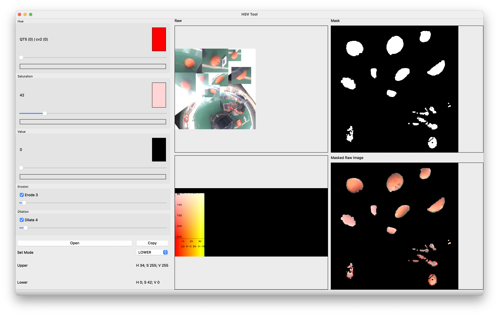

# HSV Range Tool
A tool for selecting optimal range (Including dilation and erotion) for HSV
## App preview (Using example image)

## How to run:
Make sure you have `python` installed on your system. Instal required dependency by running `pip install -r requirements.txt` in your terminal or install manually `PyQt5` and `Opencv-Python`

If you're using virtualenv don't forget to `source` into your venv before proceeding

After configuring your environment, run `python3 main.py` or if you're on Mac, you can run `make run` as a shortcut
Open a picture by clicking `Open` button

Adjust the Hue of both Upper range and Lower range before proceeding to adjust Saturation and Value (As adjusting Hue have the biggest impact)

You can use picture in `./example` for training, try to adjust the Upper and Lower range so only the ball is visible

You can also adjust `dilation` and `erotion` which usually used along with HSV in opencv computer vision project

## Run using **DOCKER**
### Simply build and run in 1 step using docker compose:
```sh
docker-compose up
```
### or build and run manually in 2 steps
1. Build docker image
```sh
 docker build -t myapp .
 ```
2. Run using: 
```sh
docker run --rm -it -v /tmp/.X11-unix:/tmp/.X11-unix -e DISPLAY=$DISPLAY -u qtuser -v $(pwd):/app -w /app myapp
```


## Fork of Project
I made this project for workshops that I did for Technology Artisan (An organization that I am a part of in college) and therefor you can also find the project there ([Technology Artisan Intro to Computer Vision repo](https://github.com/TecArt-Udayana/intro-to-computer-vision-2021) under `hsv_tool`). This fork also have additional feature (Hough transform, line detection etc) which added by my senior (@RicoFerdian) which I wouldn't include here since I want this repo to just focus as ranging tool

Also, as I stated above I made this tool just to introduce my friends (Including myself) to computer vision in a workshop, but this tool proved useful in a lot of ways, especially a project that I did in __wheeled soccer robot__ ([Beroda Gandiwa](https://github.com/gandiwaberoda)). If anyone looking for a helper tool, but too lazy to create one of their own, you can use this tool, and pull request is also welcome